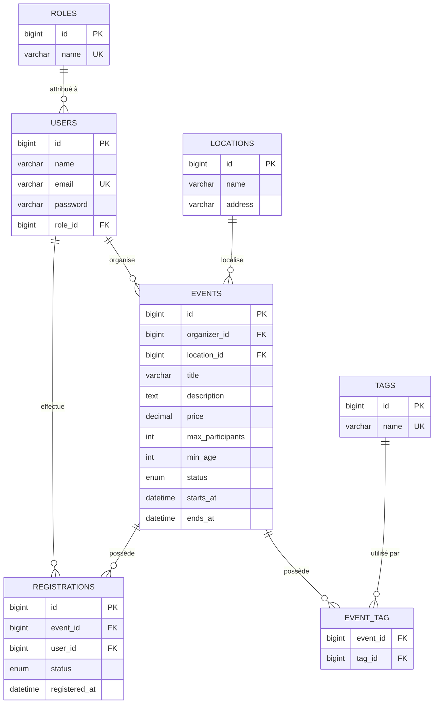

# Data base

```mermaid
erDiagram

    USERS {
        bigint id PK
        varchar name
        varchar email UK
        varchar password
        bigint role_id FK
    }

    ROLES {
        bigint id PK
        varchar name UK
    }

    EVENTS {
        bigint id PK
        bigint organizer_id FK
        bigint location_id FK
        varchar title
        text description
        decimal price
        int max_participants
        int min_age
        enum status
        datetime starts_at
        datetime ends_at
    }

    REGISTRATIONS {
        bigint id PK
        bigint event_id FK
        bigint user_id FK
        enum status
        datetime registered_at
    }

    TAGS {
        bigint id PK
        varchar name UK
    }

    EVENT_TAG {
        bigint event_id FK
        bigint tag_id FK
    }

    LOCATIONS {
        bigint id PK
        varchar name
        varchar address
    }

    ROLES ||--o{ USERS : "attribué à"

    USERS ||--o{ EVENTS : "organise"
    USERS ||--o{ REGISTRATIONS : "effectue"

    EVENTS ||--o{ REGISTRATIONS : "possède"

    EVENTS ||--o{ EVENT_TAG : "possède"
    TAGS ||--o{ EVENT_TAG : "utilisé par"

    LOCATIONS ||--o{ EVENTS : "localise"
```